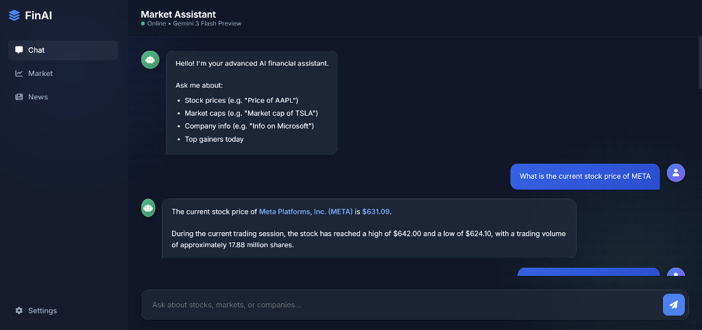
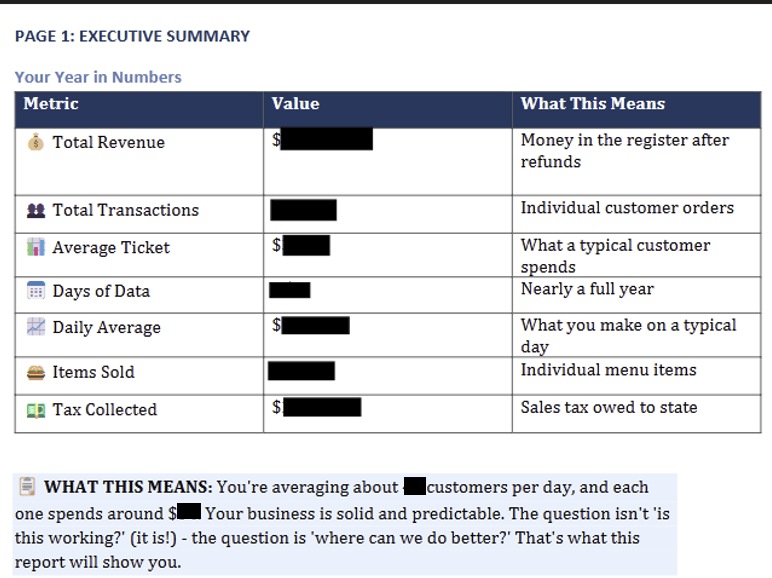
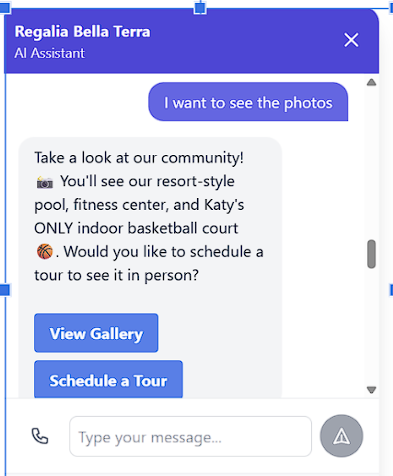

# Hi, I'm Akshay Sapkale 👋

### **MS Quantitative Finance | AI Automation Specialist**

*I build AI agents that automate entire business functions—Finance, Marketing, Sales, Analytics.*

---

## 🎯 What I Do

I build **Level 3 Autonomous Agents**—AI systems that don't just respond to prompts, but autonomously perceive, reason, plan, and execute. I've applied the same agentic architecture across Finance, Marketing, Sales, and Business Intelligence.

> **"If a human can do it with a screen and a keyboard, I can build an agent to do it."**

---

## 🚀 Featured Projects

<table>
<tr>
<td width="60%" valign="top">

### 🏦 [FinAI — AI Agent for Finance](https://github.com/akshaysapkale007/Quantitative-Finance-AI-Agent)
> AI agentic system for real-time portfolio analysis and quantitative insights through NLP and Python.

- Real-time portfolio valuation with live market prices via OpenBB
- Multi-tool orchestration using ReAct (Reason + Act) pattern
- Institutional-grade analysis combining technicals & fundamentals

`Python` `LangGraph` `LangChain` `Gemini 3 Flash` `OpenBB` `Flask` `Tavily`

</td>
<td width="40%" valign="top" align="center">

</td>
</tr>
</table>

---

<table>
<tr>
<td width="60%" valign="top">

### 📊 [RestoAI — Autonomous Business Strategist](https://github.com/akshaysapkale007/AI-Consultant---Restaurant)
> Turns raw POS data into a $47K+ strategic report in 4 minutes.

- 15 statistical modules (BCG Matrix, cohort analysis, time-series)
- Cognitive architecture: Perception → Reasoning → Action
- ROI quantification for every recommendation

`Python` `Claude Opus 4.5` `Pandas` `NumPy` `Matplotlib` `Vertex AI`

</td>
<td width="40%" valign="top" align="center">

</td>
</tr>
</table>

---

<table>
<tr>
<td width="60%" valign="top">

### 💼 [Sales AI Agent](https://github.com/akshaysapkale007/Sales-AI-Agent)
> Autonomous sales agent that collects and qualifies leads 24/7 with agentic architecture.

- Generative UI: Renders interactive React components based on context
- Self-improving: Uses NLP feedback loops to optimize prompts
- Multi-tenant SaaS: Secure data isolation for enterprise use

`React` `TypeScript` `Node.js` `Firebase` `Firestore` `Gemini 3 Flash` `Cloud Functions`

</td>
<td width="40%" valign="top" align="center">

</td>
</tr>
</table>

---

<table>
<tr>
<td width="60%" valign="top">

### 🎨 [Marketing Agent AI](https://github.com/akshaysapkale007/marketing-agent-ai)
> Paste a URL, get complete marketing campaigns with AI-generated images.

- Brand DNA Extraction: Multi-page crawling + multimodal vision
- Campaign Generation: Copy, hashtags, and schedules
- AI Image Studio: Imagen 4 integration for product shots

`TypeScript` `React` `Firebase` `Gemini 3 Flash` `Imagen 4` `Vertex AI` `Cloud Functions`

</td>
<td width="40%" valign="top" align="center">

</td>
</tr>
</table>

---

## 🛠️ What I Bring

**Strategic Skills**
- Business Value Translation
- System Architecture Decisions
- Agentic Reasoning Design
- Data Pipeline Design
- Enterprise SAAS Architecture
- Multi-Tenant Security Models
- Prompt Orchestration Strategy
- UX/Product Decisions
- AI Failure Mode Handling
- Cross-Modal Alignment (Vision + Copy + UI)

**Tools:** Python, TypeScript, React, LangChain,LLM Integration, Google Cloud, Antigravity Firebase, Vertex AI, Vision Models

---

### 💬 Let's Connect

**Got a workflow that needs automating?** I can build an agent for it.

**Open to:** Fintech · AI Automation · Business Intelligence · Agentic Systems

